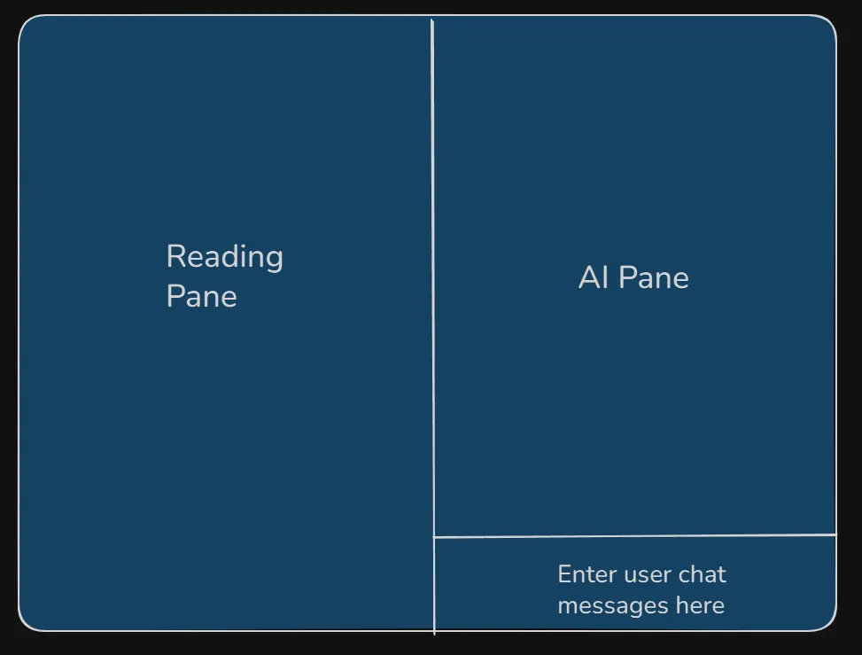

This is a study assitant that allows study of a pdf file along with an AI.

When reading a pdf document instead of opening it up in a pdf viewer I will to open it up in my own program/web page. The layout is attached.




On the left pane I can read the pdf just like a normal pdf document. On the right pane, an AI is processing the page I am reading along with some more context and provides helpful hints to understand things. Bottom of the right pane is a chat panel where I can ask questions and the AI answers in the AI pane.

We can assume the program is connected with a background ollama model running. I can run the ollama model using ollama. So the program just needs to communicate with that for AI functionality.

the pdfs are available in a local directory underneath the react app.

## Recommended Architecture:

### **Frontend: React + TypeScript**
- **PDF Rendering**: Use `react-pdf` (wrapper around PDF.js) - battle-tested, handles research papers well
- **UI Framework**: Tailwind CSS or shadcn/ui for quick, modern styling
- **State Management**: React Context or Zustand for managing current page, chat history
- **Layout**: CSS Grid or Flexbox for the three-pane layout
- **Pages**:
  1. **Home/Library**: Grid view of available PDFs
  2. **Reader**: The three-pane layout for reading

### **Backend: Python FastAPI**
- **Why Python**: Better PDF text extraction libraries (PyPDF2, pdfplumber)
- **Ollama Integration**: Simple HTTP requests to Ollama's REST API
- **Endpoints**:
  - `GET /pdfs` - List all PDFs in the local directory
  - `GET /pdf/{filename}/page/{page_num}` - Get rendered page
  - `GET /pdf/{filename}/text/{page_num}` - Get text for AI context
  - `POST /ai/analyze` - Analyze current page with context
  - `POST /ai/chat` - Chat with AI about current content

## High-Level Architecture:

```
┌────────────────────────────────────────────────────────┐
│                   React Frontend                       │
├─────────────────┬────────────────┬─────────────────────┤
│   PDF Viewer    │   AI Panel     │   Chat Interface    │
│  (react-pdf)    │ (Analysis View)│  (Message History)  │
└────────┬────────┴───────┬────────┴──────────┬──────────┘
         │                │                    │
         └────────────────┴────────────────────┘
                          │
                    FastAPI Backend
                          │
         ┌────────────────┴────────────────┐
         │                                 │
    PDF Processing                   Ollama Client
    (Text Extraction)                (HTTP Requests)
                                          │
                                    Ollama Server
                                    (Running locally)
```

## Key Design Decisions:

1. **Stateless Page Analysis**: Each page change triggers a new analysis with context (current ± 1 page)
2. **Streaming AI Responses**: Use Server-Sent Events (SSE) for streaming Ollama responses
3. **Lazy PDF Loading**: Load pages on demand rather than entire PDF
4. **WebSocket for Chat**: Real-time communication for the chat interface

Would you like me to create a detailed implementation plan with specific libraries and code structure? I can also start with a basic proof-of-concept focusing on the core functionality.
