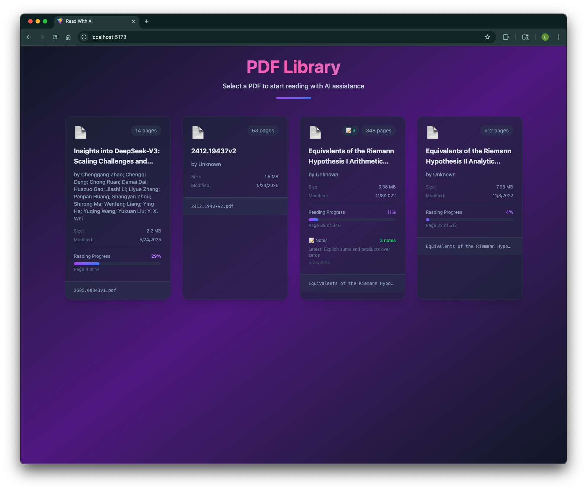
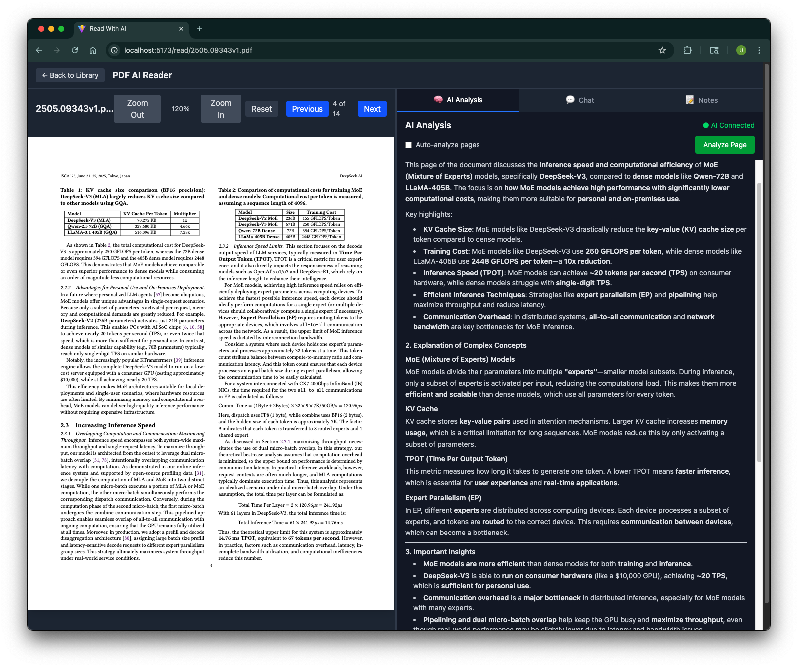
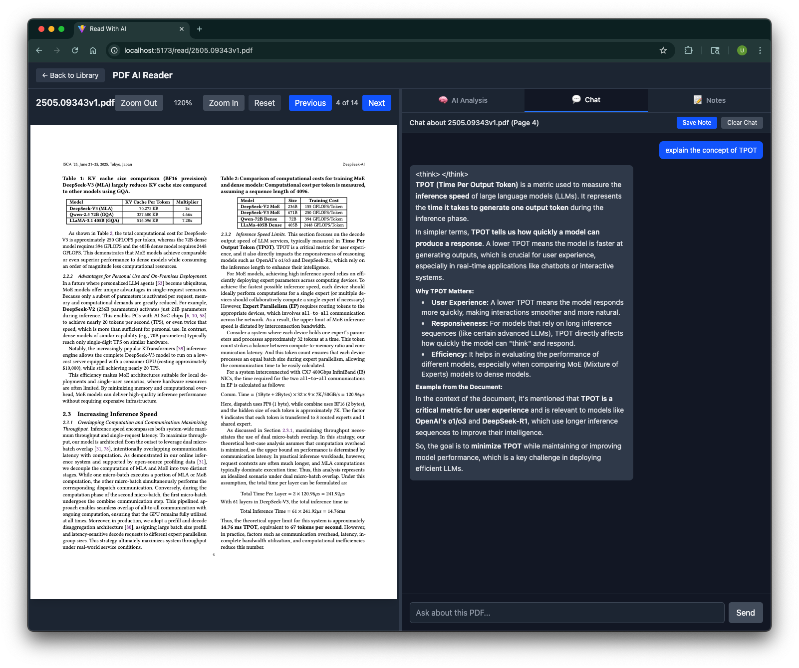
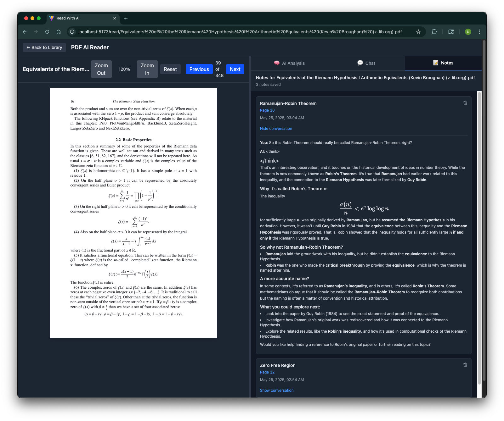

# PDF Learn AI

A full-stack application for AI-powered PDF analysis and learning, built with FastAPI, React, and Ollama.

## 📋 Table of Contents

- [📚 What is PDF Learn AI?](#-what-is-pdf-learn-ai)
  - [Key Features](#key-features)
  - [How It Works](#how-it-works)
- [🚀 Quick Start with Docker](#-quick-start-with-docker)
  - [Prerequisites](#prerequisites)
  - [Running the Application](#running-the-application)
  - [First Run](#first-run)
  - [Monitoring](#monitoring)
  - [Stopping the Application](#stopping-the-application)
- [🛠️ Development Setup](#️-development-setup)
  - [Backend (FastAPI)](#backend-fastapi)
  - [Frontend (React + Vite)](#frontend-react--vite)
  - [Ollama](#ollama)
- [📁 Project Structure](#-project-structure)
- [🔧 Configuration](#-configuration)
  - [Environment Variables](#environment-variables)
  - [Ports](#ports)
  - [Volumes](#volumes)
- [🐛 Troubleshooting](#-troubleshooting)
  - [Common Issues](#common-issues)
  - [Health Checks](#health-checks)
- [🤝 Contributing](#-contributing)
- [📄 License](#-license)

## 📚 What is PDF Learn AI?

PDF Learn AI is an intelligent study assistant that transforms how you read and understand PDF documents. Instead of opening PDFs in a traditional viewer, this application provides an interactive learning environment where an AI companion helps you comprehend complex content in real-time.

### Key Features

**🏠 Smart Library Management**
Browse and organize your PDF collection with an intuitive library interface.



**📖 Enhanced Reading Experience**
Read PDFs with AI-powered assistance that analyzes each page as you navigate through the document.



**🤖 Intelligent AI Analysis**
Get contextual insights, summaries, and explanations for the content you're reading. The AI processes the current page along with surrounding context to provide relevant assistance.



**📝 Interactive Note-Taking**
Ask questions, take notes, and engage in conversations about the document content. The AI maintains context throughout your reading session.



### How It Works

1. **Upload or Select PDFs**: Choose from your local PDF collection
2. **AI-Powered Reading**: As you read, the AI analyzes each page and provides helpful insights
3. **Interactive Chat**: Ask questions about the content and get instant, contextual answers
4. **Smart Notes**: Take notes and let the AI help you understand complex concepts

The application uses Ollama for local AI processing, ensuring your documents stay private while providing powerful language model capabilities.

## 🚀 Quick Start with Docker

The easiest way to run this application is using Docker Compose. This will automatically set up all required services including the backend API, frontend web app, and Ollama AI models.

### Prerequisites

- [Docker](https://docs.docker.com/get-docker/) (version 20.10 or higher)
- [Docker Compose](https://docs.docker.com/compose/install/) (version 2.0 or higher)

### Running the Application

1. **Clone the repository:**
   ```bash
   git clone <repository-url>
   cd pdf_learn_ai
   ```

2. **Start all services:**
   ```bash
   docker compose up -d
   ```

   This command will:
   - Pull and start the Ollama service
   - Build and start the FastAPI backend
   - Build and start the React frontend
   - Download required AI models (qwen3:30b)

3. **Access the application:**
   - **Frontend:** http://localhost:3000
   - **Backend API:** http://localhost:8000
   - **API Documentation:** http://localhost:8000/docs
   - **Ollama API:** http://localhost:11434

### First Run

The first time you run the application, it will take several minutes to:
- Download Docker images
- Build the frontend and backend
- Pull AI models (several GB of data)

Subsequent runs will be much faster as everything is cached.

### Monitoring

Check the status of all services:
```bash
docker compose ps
```

View logs for all services:
```bash
docker compose logs -f
```

View logs for a specific service:
```bash
docker compose logs -f backend
docker compose logs -f frontend
docker compose logs -f ollama
```

### Stopping the Application

```bash
docker compose down
```

To also remove volumes (this will delete downloaded AI models):
```bash
docker compose down -v
```

## 🛠️ Development Setup

If you prefer to run the services individually for development:

### Backend (FastAPI)

1. **Prerequisites:**
   - Python 3.12+
   - [uv](https://docs.astral.sh/uv/) package manager

2. **Setup:**
   ```bash
   cd backend
   uv sync
   uv run uvicorn main:app --reload --host 0.0.0.0 --port 8000
   ```

### Frontend (React + Vite)

1. **Prerequisites:**
   - Node.js 18+
   - npm

2. **Setup:**
   ```bash
   cd frontend
   npm install
   npm run dev
   ```

### Ollama

1. **Install Ollama:**
   - Follow instructions at [ollama.ai](https://ollama.ai)

2. **Pull required models:**
   ```bash
   ollama pull qwen3:30b
   ```

## 📁 Project Structure

```
pdf_learn_ai/
├── backend/                 # FastAPI backend
│   ├── app/                # Application modules
│   ├── pdfs/               # PDF storage
│   ├── data/               # Application data
│   ├── main.py             # FastAPI entry point
│   ├── pyproject.toml      # Python dependencies
│   └── Dockerfile          # Backend container
├── frontend/               # React frontend
│   ├── src/                # Source code
│   ├── public/             # Static assets
│   ├── package.json        # Node.js dependencies
│   ├── Dockerfile          # Frontend container
│   └── nginx.conf          # Nginx configuration
├── docker-compose.yml      # Docker orchestration
└── README.md              # This file
```

## 🔧 Configuration

### Environment Variables

The Docker setup uses the following environment variables:

- `OLLAMA_BASE_URL`: URL for Ollama service (default: http://ollama:11434)
- `VITE_API_BASE_URL`: Backend API URL for frontend (default: http://localhost:8000)

### Ports

- **3000**: Frontend web application
- **8000**: Backend API
- **11434**: Ollama API

### Volumes

- `ollama_data`: Persistent storage for AI models
- `./backend/pdfs`: PDF file storage
- `./backend/data`: Application data storage

## 🐛 Troubleshooting

### Common Issues

1. **Port conflicts:**
   - Make sure ports 3000, 8000, and 11434 are not in use
   - Modify ports in `docker-compose.yml` if needed

2. **Slow first startup:**
   - AI model downloads can take 10-20 minutes depending on internet speed
   - Check progress with: `docker compose logs -f model-init`

3. **Out of disk space:**
   - AI models require ~4GB of storage
   - Clean up unused Docker resources: `docker system prune`

4. **Memory issues:**
   - Ollama requires at least 8GB RAM for qwen3:30b (it's a larger model)
   - Consider using a smaller model like qwen3:7b if you have limited RAM

### Health Checks

All services include health checks. Check service health:
```bash
docker compose ps
```

Healthy services will show "healthy" status.

## 🤝 Contributing

1. Fork the repository
2. Create a feature branch
3. Make your changes
4. Test with Docker Compose
5. Submit a pull request

## 📄 License

This project is licensed under the MIT License - see the [LICENSE](LICENSE) file for details.

The MIT License is one of the most permissive open source licenses, allowing you to:
- ✅ Use the software for any purpose (commercial or personal)
- ✅ Modify and distribute the software
- ✅ Include it in proprietary software
- ✅ Sell copies of the software

The only requirement is to include the original copyright notice and license text in any copies or substantial portions of the software.
